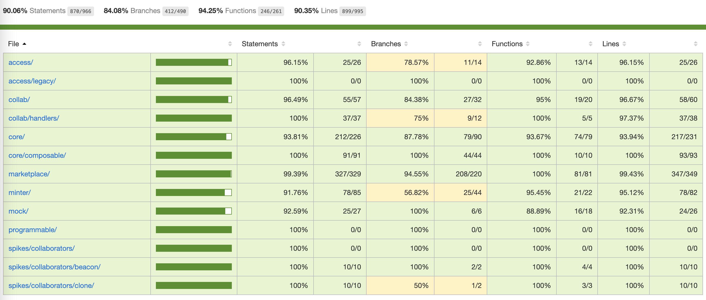

# KnownOrigin V3 Smart Contracts

## The Core Guiding Principles

* GAS efficient - every byte counts, store only what is required `creator`, `edition size` & `metadata`
* [ERC-721](https://eips.ethereum.org/EIPS/eip-721) compliant NFTs
    * Ability to mint single 1 of 1 NFTs
    * Ability to mint batches of NFT (multi-editions)
    * Collaboration support for `1..n` collaborators with royalties - predetermined addresses
* Replace whitelisting with merkle proofs for minting access
* Support for [ERC-2981: Royalty Standard](https://eips.ethereum.org/EIPS/eip-2981)
* Support for [ERC-998 Top-down ERC-20 composable](https://eips.ethereum.org/EIPS/eip-998) (optional)
* Support for [ERC-2309: Consecutive batch mint](https://eips.ethereum.org/EIPS/eip-2309) (optional)
* Support for [Rarible V2 royalties standard](https://docs.rarible.com/asset/royalties-schema) (optional)
* Support for a proxy management account for creatives (optional)
* Support programmable/dynamic token URIs in the future (future iteration)
* Support metadata updates before the first sale has been made (optional)
* Sealed Metadata: Support to set a one time `perma-web` backup of token metadata

### GAS & Coverage

* `GAS` report can be found [here](./gas-report-output.md) and generated on demand via `npm run gas`
* Contract size report found [here](./contract-size.md) or generated on demand via `npm run contract-size`
* Code coverage generation via `npm run coverage` output in `./coverage` folder



## Deployments

### Rinkeby

```
Core NFT                   - 0x1Ed168725D86d7153cB65A984687342F8AF39931 (verified)
AccessControls             - 0xB078C9E804cAcBD4C20161FB7F3af464dE960349 (verified)
Minting Factory            - 0x1276221e802596E4aE1b49aBd5018B42776B5CcE (verified)
Primary marketplace        - 0x039F462954a69961e7fe388dB5AB3Bce4Ae1d41f (verified)
Secondary marketplace      - 0x6F928Da4eE5C22fc7a53AAe6A05216EE6D79E243 (verified)
Collab royalties registry  - 0x1648F0dBdf3329034d2751CaC3bE2a0fA7D1fd19 (verified)
Omni deployer              - 0x6b277Fe32E5b8cAa4E7C077aced78299e124B448 (verified)
V1 funds splitter          - 0x9C7520747e7ec7aE7fa8314fC7463d7590785b01 (verified) 
V1 funds receiver          - 0x6045ef85B6337b1a5cBb331413f5b712DE503f17 (verified) 
```

### Mainnet

```
NFT                        - 
AccessControls             - 
Minting Factory            - 
Primary marketplace        - 
Secondary marketplace      - 
Collab royalties registry  - 
V1 funds reciever           - 
```

### How to?

Use `hardhat` deploy for - see `/scripts` folder for more info e.g.

`npx hardhat run --network rinkeby scripts/X_my_script.js`

To verify also try hardhat but this sometimes fails, and you need to use the flat contracts.

### Minting controls via merkle tree

1. Get enabled creators
```
node ./utils/v3-migration/1_gather_and_generate_data.js
```

2. Create proofs
```
node ./utils/v3-migration/2_create_and_store_merkle_tree.js
```

3. Update access controls with these values - refresh the web app
